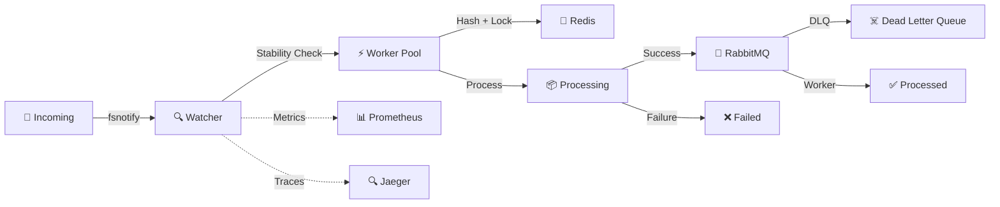

# 🎯 Gordon Watcher

> **Production-ready file system monitoring and processing pipeline with enterprise-grade observability**

[](https://golang.org/)
[](LICENSE)
[](https://www.docker.com/)
[](https://www.rabbitmq.com/)
[](https://prometheus.io/)
[](https://www.jaegertracing.io/)


## 📖 Overview

**Gordon Watcher** é um sistema robusto de monitoramento de sistema de arquivos, projetado para detectar, processar e enfileirar arquivos de forma confiável e escalável. Ideal para pipelines de processamento de documentos, integração de sistemas, ETL e automação de workflows.

### 🌟 Principais Características

- 🔍 **Monitoramento em Tempo Real**: Detecta novos arquivos instantaneamente usando `fsnotify`
- 🚀 **Alta Performance**: Worker pool concorrente com rate limiting configurável
- 🛡️ **Resiliência Total**: Circuit breaker, retry automático e reconciliação de órfãos
- 📊 **Observabilidade Completa**: Métricas Prometheus, tracing Jaeger e logs estruturados
- 🔒 **Idempotência**: Previne processamento duplicado com hashing SHA256
- 🐰 **Message Queue**: Integração RabbitMQ com Dead Letter Queue (DLQ)
- 🔴 **Distributed Locks**: Redis para coordenação em ambientes multi-instância
- 🐳 **Cloud Native**: Docker, Kubernetes-ready, health checks e graceful shutdown

---

## 🎨 Arquitetura



### 📂 Fluxo de Processamento

1. **📥 Detecção**: Arquivos são detectados na pasta `incoming`
2. **⏱️ Estabilização**: Aguarda até o arquivo parar de ser escrito
3. **🔐 Hash**: Calcula SHA256 para idempotência
4. **🔒 Lock**: Adquire lock distribuído no Redis
5. **📦 Movimentação**: Move para `processing`
6. **🐰 Enfileiramento**: Publica no RabbitMQ com retry + circuit breaker
7. **✅ Finalização**: Arquivo fica em `processing` até o worker externo processar

---

## 🚀 Quick Start

### Pré-requisitos

- 🐳 Docker & Docker Compose
- 🐹 Go 1.21+ (para desenvolvimento)

### 🏃 Rodando com Docker Compose

```bash
# 1. Clone o repositório
git clone https://github.com/fabyo/gordon-watcher.git
cd gordon-watcher

# 2. Configure o ambiente
cp .env.example .env
cp docker-compose.override.yml.example docker-compose.override.yml

# 3. Descubra o IP do servidor (para Samba)
make discover-ip
# Anote o "IP do WSL" que aparecer

# 4. Suba o stack completo
docker compose up -d

# 5. Verifique o status
docker compose ps

# 6. Abra o Dashboard no navegador
open web/dashboard.html
# Ou: firefox web/dashboard.html
# Ou: google-chrome web/dashboard.html

# 7. Monitore os logs
docker compose logs -f watcher
```

### 🪟 Acesso Windows (Samba)

O Docker Compose já inclui compartilhamento Samba para você jogar arquivos do Windows!

#### 1. Descobrir o IP do Servidor

**No Linux/WSL, rode:**
```bash
make discover-ip
```

**Saída esperada:**
```
🔍 Descobrindo IPs...

📍 IP do WSL (Docker): 172.24.123.45
🪟 IP do Windows: 192.168.1.100

Para conectar do Windows ao Samba:
  \\172.24.123.45\incoming

Credenciais:
  Usuário: gordon
  Senha: gordon123
```

#### 2. Conectar do Windows

**Opção A: Acesso Direto**
1. Abra o **Explorador de Arquivos**
2. Digite na barra de endereço:
   ```
   \\172.24.123.45\incoming
   ```
   *(Use o IP que apareceu no `make discover-ip`)*
3. Digite as credenciais:
   - **Usuário**: `gordon`
   - **Senha**: `gordon123`

**Opção B: Mapear Unidade de Rede (Recomendado)**

1. Abra o **Explorador de Arquivos**
2. Clique com botão direito em **"Este Computador"**
3. Selecione **"Mapear unidade de rede"**
4. Escolha a letra **Z:** (ou outra disponível)
5. **Pasta**: `\\172.24.123.45\incoming`
6. Marque **"Reconectar ao fazer logon"**
7. Marque **"Conectar usando credenciais diferentes"**
8. Clique em **"Concluir"**
9. Digite:
   - **Usuário**: `gordon`
   - **Senha**: `gordon123`

**Ou via CMD/PowerShell:**
```cmd
net use Z: \\172.24.123.45\incoming /user:gordon gordon123 /persistent:yes
```

#### 3. Usar

Agora você pode jogar XMLs direto na unidade **Z:** do Windows! 🎉

Os arquivos serão processados automaticamente pelo Gordon Watcher.

### 🎯 Testando

```bash
# Coloque um arquivo na pasta monitorada
echo "Hello Gordon!" > /opt/gordon-watcher/data/incoming/test.xml

# Acompanhe o processamento
docker compose logs -f watcher

# Verifique as métricas
curl http://localhost:9100/metrics | grep gordon_watcher
```

---

## 📊 Observabilidade

### 📈 Dashboard de Métricas

**Visualize TUDO em tempo real!**

O Gordon Watcher inclui um dashboard HTML pratico e funcional que mostra todas as métricas importantes.

#### 🚀 Como Abrir

**Opção 1: Diretamente no Navegador (Recomendado)**
```bash
# Linux
xdg-open web/dashboard.html

# macOS
open web/dashboard.html

# Windows (WSL)
explorer.exe web/dashboard.html
```

**Opção 2: Via Servidor HTTP**
```bash
cd web && python3 -m http.server 8000
# Acesse: http://localhost:8000/dashboard.html
```

#### 📊 O Que Você Vê

O dashboard mostra **8 cards principais** com atualização automática a cada 5 segundos:

**Arquivos:**
- 📥 **Detectados**: Total de arquivos encontrados pelo watcher
- ✅ **Enviados**: Processados com sucesso e enfileirados no RabbitMQ
- 🔄 **Duplicados**: Já processados anteriormente (idempotência funcionando!)
- ❌ **Rejeitados**: Padrão ou tamanho inválido
- 🚫 **Ignorados**: Arquivos ignorados por regras de exclusão

**Sistema:**
- ⚡ **Goroutines**: Threads ativas (para detectar memory leaks)
- 👷 **Workers Ativos**: Quantos workers estão processando agora
- 📦 **Fila de Workers**: Arquivos aguardando processamento

**Taxa de Processamento:**
- 📈 Percentual de sucesso
- 📊 Total processado

#### 🔗 Links Rápidos

O dashboard inclui botões para acessar:
- 📊 **Métricas Prometheus** (dados brutos)
- 🏥 **Health Check** (status do serviço)
- 🐰 **RabbitMQ Management** (filas e mensagens)
- 🔍 **Jaeger Tracing** (rastreamento distribuído)

#### 💡 Exemplo de Uso

1. **Abra o dashboard**
2. **Jogue um XML** na pasta compartilhada (Samba)
3. **Veja em tempo real**:
   - "Detectados" aumenta (+1)
   - "Enviados" aumenta (+1) após processamento
   - "Workers Ativos" mostra 1 durante o processamento
4. **Se jogar o mesmo arquivo de novo**:
   - "Duplicados" aumenta (+1)
   - Arquivo não é reprocessado (idempotência!)

**Atualização automática a cada 5 segundos!** 🔄

### 🏥 Health Checks

```bash
# Liveness (está vivo?)
curl http://localhost:8081/health

# Readiness (está pronto para receber tráfego?)
curl http://localhost:8081/ready
```

### 📈 Métricas Prometheus

**Endpoint**: `http://localhost:9100/metrics`

| Métrica | Tipo | Descrição |
|---------|------|-----------|
| `gordon_watcher_files_detected_total` | Counter | Total de arquivos detectados |
| `gordon_watcher_files_sent_total` | Counter | Arquivos enviados para fila |
| `gordon_watcher_files_duplicated_total` | Counter | Arquivos duplicados (já processados) |
| `gordon_watcher_files_rejected_total` | Counter | Arquivos rejeitados (padrão/tamanho) |
| `gordon_watcher_queue_errors_total` | Counter | Erros ao publicar no RabbitMQ |
| `gordon_watcher_goroutines` | Gauge | Número de goroutines ativas |
| `gordon_watcher_worker_pool_queue_size` | Gauge | Tamanho da fila de workers |
| `gordon_watcher_file_processing_seconds` | Histogram | Tempo de processamento |

### 🔍 Distributed Tracing (Jaeger)

**UI**: `http://localhost:16686`

Visualize o fluxo completo de cada arquivo:
- Detecção → Estabilização → Hash → Lock → Queue → Worker

### 🐰 RabbitMQ Management

**UI**: `http://localhost:15672`  
**Credenciais**: `gordon` / `gordon123`

- Monitore filas e exchanges
- Visualize mensagens na DLQ
- Acompanhe throughput

---

## ⚙️ Configuração

### 📝 Arquivo de Configuração

Edite `configs/config.yaml`:

```yaml
watcher:
  paths:
    - /opt/gordon-watcher/data/incoming
  
  file_patterns:
    - "*.xml"
    - "*.pdf"
    - "*.json"
  
  exclude_patterns:
    - ".*"           # Arquivos ocultos
    - "*.tmp"        # Temporários
    - "*Zone.Identifier"  # Windows WSL
  
  min_file_size: 100          # bytes
  max_file_size: 104857600    # 100MB
  
  max_workers: 10
  max_files_per_second: 100
```

### 🔐 Variáveis de Ambiente

Veja `.env.example` para todas as opções disponíveis.

---

## 🛡️ Resiliência e Segurança

### 🔄 Retry com Backoff Exponencial

```go
// Configuração padrão
MaxAttempts:   3
InitialDelay:  1s
MaxDelay:      30s
Multiplier:    2.0
```

### ⚡ Circuit Breaker

Protege contra falhas em cascata:
- **Threshold**: 5 falhas consecutivas
- **Timeout**: 30 segundos
- **Estados**: Closed → Open → Half-Open

### 🔒 Idempotência

- Hash SHA256 de cada arquivo
- Verificação no Redis antes de processar
- Previne duplicação mesmo em multi-instância

### 🧹 Reconciliação de Órfãos

Na inicialização, arquivos órfãos em `processing` são movidos de volta para `incoming`.

### 🚨 Dead Letter Queue (DLQ)

Mensagens que falharem após todas as tentativas vão para `gordon.files.dlq` para análise manual.

---

## 🎯 Casos de Uso

### 📄 Processamento de Documentos Fiscais (NFe)

```yaml
watcher:
  paths:
    - /data/nfe/incoming
  file_patterns:
    - "*.xml"
  max_workers: 20
  max_files_per_second: 200
```

### 📊 ETL de Arquivos CSV

```yaml
watcher:
  paths:
    - /data/exports/incoming
  file_patterns:
    - "*.csv"
    - "*.tsv"
  min_file_size: 1024  # Ignora CSVs vazios
```

### 🖼️ Processamento de Imagens

```yaml
watcher:
  paths:
    - /data/uploads/incoming
  file_patterns:
    - "*.jpg"
    - "*.png"
    - "*.webp"
  max_file_size: 52428800  # 50MB
```

### 📦 Integração de Sistemas (EDI)

```yaml
watcher:
  paths:
    - /data/edi/incoming
  file_patterns:
    - "*.edi"
    - "*.x12"
  stable_attempts: 10      # Arquivos grandes
  stable_delay: 500ms
```

---

## 🐳 Deploy

### Docker

```bash
# Build
docker build -t gordon-watcher:latest -f docker/Dockerfile .

# Run
docker run -d \
  -v /opt/gordon-watcher/data:/opt/gordon-watcher/data \
  -p 8081:8081 \
  -p 9100:9100 \
  gordon-watcher:latest
```

### Kubernetes

```yaml
apiVersion: apps/v1
kind: Deployment
metadata:
  name: gordon-watcher
spec:
  replicas: 3
  selector:
    matchLabels:
      app: gordon-watcher
  template:
    metadata:
      labels:
        app: gordon-watcher
    spec:
      containers:
      - name: watcher
        image: gordon-watcher:latest
        ports:
        - containerPort: 8081
          name: health
        - containerPort: 9100
          name: metrics
        volumeMounts:
        - name: data
          mountPath: /opt/gordon-watcher/data
        livenessProbe:
          httpGet:
            path: /health
            port: 8081
        readinessProbe:
          httpGet:
            path: /ready
            port: 8081
```

### Ansible

```bash
cd ansible
ansible-playbook -i inventory/development.yml deploy.yml
```

---

## 🔧 Desenvolvimento

### 📦 Instalação

```bash
# Clone
git clone https://github.com/fabyo/gordon-watcher.git
cd gordon-watcher

# Instale dependências
go mod download

# Build
make build

# Run
./bin/gordon-watcher
```

### 🧪 Testes

```bash
# Testes unitários
make test

# Cobertura
make coverage

# Lint
make lint
```

### 📝 Makefile Targets

```bash
make build          # Compila o binário
make test           # Roda testes
make lint           # Roda linter
make docker-build   # Build Docker image
make docker-up      # Sobe stack completo
make docker-down    # Para stack
make clean          # Limpa binários
```

---

## 🔒 Segurança

### ✅ Boas Práticas Implementadas

- ✅ **Usuário não-root**: Container roda como `gordon` (UID 1000)
- ✅ **Imagem mínima**: Alpine Linux (< 20MB)
- ✅ **Secrets externos**: Credenciais via env vars, nunca hardcoded
- ✅ **Health checks**: Liveness e readiness probes
- ✅ **Graceful shutdown**: Finaliza processamento antes de parar
- ✅ **Rate limiting**: Previne sobrecarga
- ✅ **Input validation**: Valida tamanho e padrões de arquivo

### 🔐 Recomendações para Produção

1. **TLS/SSL**: Use AMQPS para RabbitMQ
2. **Autenticação**: Configure Redis com senha
3. **Network Policies**: Isole pods no Kubernetes
4. **Resource Limits**: Defina CPU/Memory limits
5. **Secrets Management**: Use Vault ou Kubernetes Secrets
6. **Audit Logs**: Habilite logs estruturados em JSON

---

## 📚 Documentação Adicional

- 📖 [Arquitetura Detalhada](docs/architecture.md)
- 🔧 [Guia de Configuração](docs/configuration.md)
- 🚀 [Guia de Deploy](docs/deployment.md)
- 🐛 [Troubleshooting](docs/troubleshooting.md)
- 📚 [GoDoc - Visualizando Documentação](docs/GODOC.md)

### 📖 API Documentation (GoDoc)

O projeto possui documentação completa no formato GoDoc:

```bash
# Visualizar localmente
godoc -http=:6060
# Acesse: http://localhost:6060/pkg/github.com/fabyo/gordon-watcher/

# Ou via terminal
go doc github.com/fabyo/gordon-watcher/internal/watcher
```

Quando publicado no GitHub, a documentação estará disponível em:  
**https://pkg.go.dev/github.com/fabyo/gordon-watcher**

---

## 🤝 Contribuindo

Contribuições são bem-vindas! Por favor:

1. Fork o projeto
2. Crie uma branch (`git checkout -b feature/amazing`)
3. Commit suas mudanças (`git commit -m 'Add amazing feature'`)
4. Push para a branch (`git push origin feature/amazing`)
5. Abra um Pull Request

---

## 📄 Licença

Este projeto está licenciado sob a MIT License - veja o arquivo [LICENSE](LICENSE) para detalhes.

---

## 👨‍💻 Autor

**Fabyo**  
📧 fabyo@example.com  
🐙 [GitHub](https://github.com/fabyo)

---

## 🙏 Agradecimentos

- [fsnotify](https://github.com/fsnotify/fsnotify) - File system notifications
- [RabbitMQ](https://www.rabbitmq.com/) - Message broker
- [Redis](https://redis.io/) - Distributed locks
- [Prometheus](https://prometheus.io/) - Metrics
- [Jaeger](https://www.jaegertracing.io/) - Distributed tracing
- [OpenTelemetry](https://opentelemetry.io/) - Observability framework

---

<div align="center">

**⭐ Se este projeto foi útil, deixe uma estrela! ⭐**

Made with ❤️ and ☕ by Fabyo

</div>
